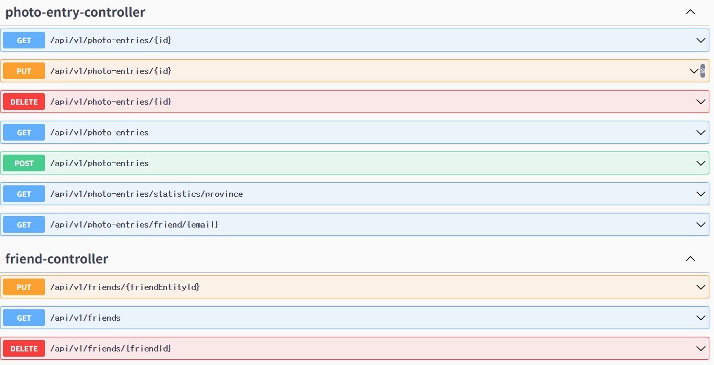
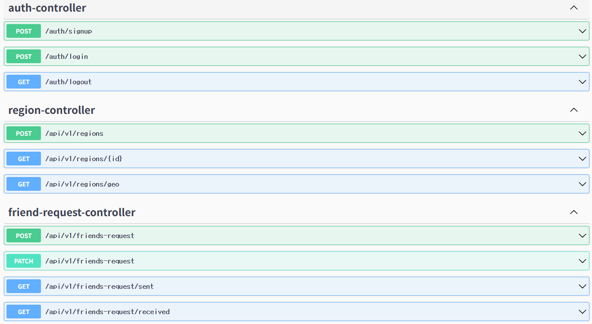
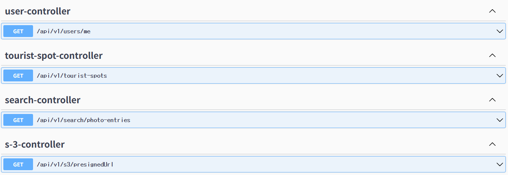

# 📷 WhereDidWeGo API 문서

본 프로젝트는 여행 기록을 지도 기반으로 저장하고 공유할 수 있는 웹 서비스입니다. 아래는 REST API 명세입니다.

---

## 🧾 목차

* [1. 회원가입/로그인](#1-회원가입로그인)
* [2. 친구 기능](#2-친구-기능)
* [3. 친구 요청 API](#3-친구-요청-api)
* [4. 사진/활동 기록](#4-사진활동-기록)
* [5. 지역 (Region)](#5-지역-region)
* [6. 관광지 조회](#6-관광지-조회)

---

## 1. 회원가입/로그인

* POST `/auth/signup` : 회원가입
* POST `/auth/login` : 로그인
* GET `/oauth2/authorization/google` : 구글 OAuth2 로그인

자세한 문서 보기: [📄 Auth.md](./docs/Auth.md)

---

## 2. 친구 기능

* GET `/api/friends` : 친구 목록 조회
* DELETE `/api/friends/{friendId}` : 친구 삭제

 자세한 문서 보기: [📄 Friend.md](./docs/Friend.md)

---

## 3. 친구 요청 API

* GET `/api/friend-requests/sent` : 보낸 친구 요청 목록
* GET `/api/friend-requests/received` : 받은 친구 요청 목록
* POST `/api/friend-requests` : 친구 요청 보내기
* PUT `/api/friend-requests/{requestId}` : 친구 요청 수락
* DELETE `/api/friend-requests/{requestId}` : 친구 요청 거절

 자세한 문서 보기: [📄 FriendRequest.md](./docs/FriendRequest.md)

---

## 4. 사진/활동 기록

* GET `/api/photo-entries` : 사진 목록 조회
* GET `/api/photo-entries/by-province` : 도 단위 통계
* POST `/api/photo-entries` : 사진 등록
* PUT `/api/photo-entries/{id}` : 사진 수정
* DELETE `/api/photo-entries/{id}` : 사진 삭제

 자세한 문서 보기: [📄 PhotoEntries.md](./docs/PhotoEntries.md)

---

## 5. 지역 (Region)

* GET `/api/v1/regions/{id}` : 특정 Region 조회
* POST `/api/v1/regions` : 좌표 기반 Region 생성

 자세한 문서 보기: [📄 Region.md](./docs/Region.md)

---

## 6. 관광지 조회

* GET `/api/v1/tourist-spots` : 지도 범위 내 관광지 조회

 자세한 문서 보기: [📄 기타.md](./docs/기타.md)

---

## 참고

